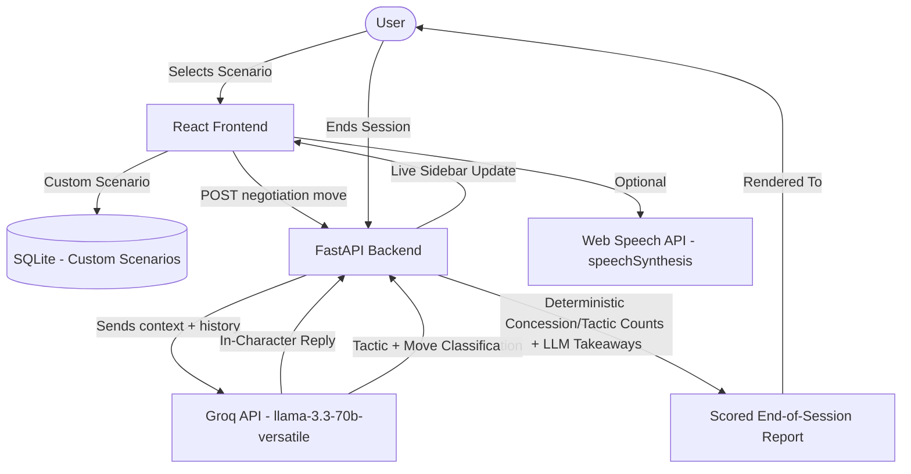
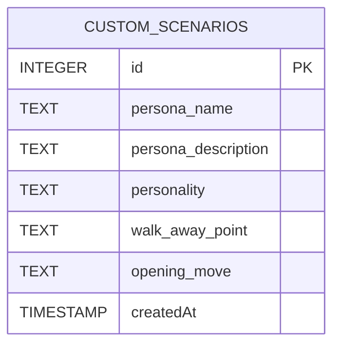

# 🚀 Counterpart - AI Negotiation Practice App

Counterpart is an **AI negotiation practice app** that lets you rehearse high-stakes conversations — salary negotiations, rent renewals, freelance pricing, vendor disputes, or a scenario you write yourself — against an **in-character AI counterpart** with its own incentives, personality, and walk-away point. Counterpart tracks the **tactics used against you**, coaches your moves in real time, and grades your performance in an **end-of-session report**.

---

## 🏗️ System Architecture & Workflow

Counterpart has no user roles or accounts — it's a single-user practice tool built around one core loop: pick a scenario, negotiate live, get coached, review a report.

### 🔄 Negotiation Session Pipeline (Workflow)



Session state (active conversations, live coaching, in-progress negotiations) is held **in memory** on the backend and is lost on restart. Only saved custom scenarios persist beyond a session, via SQLite.

### 🗄️ Database Schema

Counterpart's only persistent storage is custom user-created scenarios (up to 3 at a time). There is no schema for users, negotiation sessions, or reports — those are runtime/in-memory only.



---

## 🛠️ Technology Stack

### Backend
- **Core Engine:** FastAPI
- **AI Core:** Groq API (`llama-3.3-70b-versatile`, OpenAI-compatible chat completions) — powers the negotiation persona, tactic/coaching classification, and end-of-session report generation
- **Database:** SQLite (custom scenario storage only; created automatically on first save)
- **Session State:** In-memory (not persisted across backend restarts)

### Frontend
- **Framework & Build Tool:** React, Vite
- **Styling Engine:** Tailwind CSS
- **Voice Output:** Web Speech API (`speechSynthesis`) — reads AI replies aloud using the browser's built-in engine

### Coding Agent
- **Codex** — used as the coding agent across every phase: scaffolding, the persona/negotiation engine, tactic-recognition and coaching classifier, end-of-session report, database-backed custom scenarios, voice output, and UI polish.

---

## 📂 Project Directory Structure

```
CounterPart-AI/
├── backend/
│   ├── app/
│   │   └── main.py               # FastAPI entry point
│   ├── .venv/                    # Python virtual environment (local)
│   ├── requirements.txt
│   └── [SQLite DB file]          # Auto-created on first custom scenario save
├── frontend/
│   ├── src/                      # React components, negotiation UI, coaching sidebar
│   ├── package.json
│   └── vite.config.js
├── .env.example                  # Template: GROQ_API_KEY, GROQ_MODEL, VITE_API_URL
└── README.md
```

---

## 🚀 Installation & Local Setup

### Prerequisites
- **Python** (for the FastAPI backend, with `venv` support)
- **Node.js** (for the Vite/React frontend)
- **Groq API Key** (free tier available at the Groq Console)

### Step 1: Clone the Repository
```bash
git clone <your-repository-url>
cd CounterPart-AI
```

### Step 2: Configure the Environment
1. Copy the example environment file:
   ```bash
   copy .env.example .env
   ```
   On macOS or Linux:
   ```bash
   cp .env.example .env
   ```
2. Open `.env` and fill in your details:
   ```env
   GROQ_API_KEY=your_groq_api_key
   GROQ_MODEL=llama-3.3-70b-versatile
   VITE_API_URL=http://127.0.0.1:8000
   ```
   Get a free Groq API key from the Groq Console: https://console.groq.com/keys

### Step 3: Run the Backend
1. Navigate to the `backend` folder and set up the virtual environment:
   ```bash
   cd backend
   python -m venv .venv
   .venv\Scripts\activate
   ```
   On macOS or Linux, activate with:
   ```bash
   source .venv/bin/activate
   ```
2. Install dependencies:
   ```bash
   pip install -r requirements.txt
   ```
3. Start the server:
   ```bash
   uvicorn app.main:app --reload
   ```
   *Note: A local SQLite database file is created automatically the first time you save a custom scenario — no additional setup required.*

   The backend runs on [http://127.0.0.1:8000](http://127.0.0.1:8000).

### Step 4: Run the Frontend
1. Open a second terminal from the project root:
   ```bash
   cd frontend
   ```
2. Install dependencies:
   ```bash
   npm install
   ```
3. Start the Vite development server:
   ```bash
   npm run dev
   ```
4. Open [http://localhost:5173](http://localhost:5173) in your web browser.

---

## 📄 License

MIT License.