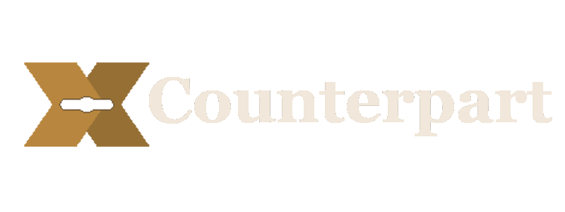
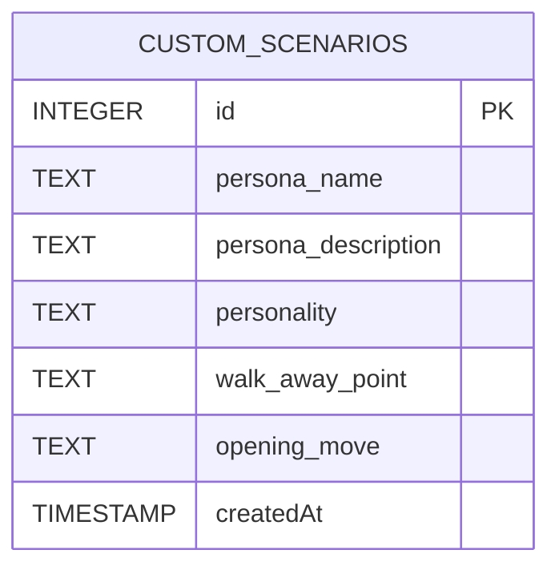

<div align="center">
  
  
  #
   
  <p><b>AI-Powered Negotiation Practice App with Real-Time Coaching & Session Reports</b></p>
 


<br>

Built with the tools and technologies:  


</div>

---

## 🧠 Project Summary

**Counterpart** is an AI negotiation practice app that lets you rehearse high-stakes conversations — salary negotiations, rent renewals, freelance pricing, vendor disputes, or a scenario you write yourself — against an **in-character AI counterpart** with its own incentives, personality, and walk-away point.

Counterpart tracks the tactics used against you, coaches your moves in real time, and grades your performance in an **end-of-session report**. It's a single-user practice tool with no accounts or roles, built around one core loop: pick a scenario, negotiate live, get coached, review a report.

---

## 🚀 Features

- 🎭 **In-Character AI Counterpart** — negotiates with its own persona, personality, and walk-away point
- 📝 **Custom Scenarios** — write and save your own negotiation scenarios (up to 3 at a time)
- 🧭 **Live Tactic Tracking** — recognizes and surfaces the tactics being used against you as the conversation unfolds
- 🪄 **Real-Time Coaching** — get move-by-move coaching in a live sidebar during the negotiation
- 📊 **End-of-Session Report** — deterministic concession/tactic counts combined with LLM-generated takeaways
- 🔊 **Voice Output** — AI replies read aloud via the browser's built-in Web Speech API
- ⚡ **In-Memory Sessions** — negotiations run live in memory for a fast, stateless practice loop

---

## 🏗️ System Architecture & Workflow

Counterpart is built around a single core loop: pick a scenario, negotiate live, get coached, review a report. Session state (active conversations, live coaching, in-progress negotiations) is held in memory on the backend and is lost on restart — only saved custom scenarios persist, via SQLite.


### 🗄️ Database Schema

The only persistent storage is custom user-created scenarios. There is no schema for users, negotiation sessions, or reports — those are runtime/in-memory only.



---

## 🗃️ Project Structure

```bash
CounterPart-AI/
├── backend/
│   ├── app/
│   │   ├── __init__.py           # Package initialization marker
│   │   ├── config.py             # Settings, environment configuration, & database path setup
│   │   ├── custom_scenarios.py   # Database access models and routes for user-created scenarios
│   │   ├── main.py               # Core application routing, Groq LLM API integrations, and CORS config
│   │   └── scenarios.py          # Pre-configured default negotiation scenarios (salary, rent, etc.)
│   ├── counterpart.db            # SQLite database for storing custom scenarios (auto-created on first save)
│   └── requirements.txt          # Python dependencies list (FastAPI, uvicorn, groq, sqlalchemy, pydantic)
├── frontend/
│   ├── public/
│   │   ├── counterpart-mark.svg  # App brand mark icon logo
│   │   └── favicon.ico           # Browser tab favicon
│   ├── src/
│   │   ├── App.jsx               # Main UI component (Scenario picker, active negotiation, coaching sidebar, scoring reports)
│   │   ├── index.css             # Main stylesheet declaring Tailwind CSS directives
│   │   └── main.jsx              # React application entry point (mounts App to index.html)
│   ├── .env.example              # Template for frontend-specific environment variables
│   ├── index.html                # Main index template containing the application container mount point
│   ├── package.json              # Node.js project configuration, metadata, and dependencies
│   ├── package-lock.json         # Node.js dependency lock file
│   ├── postcss.config.js         # Configuration for Tailwind's PostCSS parser
│   ├── tailwind.config.js        # Custom Tailwind CSS configuration for layouts and color themes
│   └── vite.config.js            # Vite configuration including backend proxy settings
├── .env.example
├── .gitignore
├── DEPLOYMENT.md
├── LICENSE
└── README.md
```

---

## 🔧 Setup & Installation

> Make sure **Python** (with `venv` support) and **Node.js** are installed on your system.

### ⚙️ Backend

```bash
# Clone the repo
git clone https://github.com/Muhammad-Ahmed-Rayyan/CounterPart-AI.git
cd CounterPart-AI/backend

# Create and activate a virtual environment
python -m venv .venv
.venv\Scripts\activate        # Windows
source .venv/bin/activate     # macOS/Linux

# Install dependencies
pip install -r requirements.txt

# Start the server
uvicorn app.main:app --reload
```

> A local SQLite database file is created automatically the first time you save a custom scenario — no additional setup required. The backend runs on [http://127.0.0.1:8000](http://127.0.0.1:8000).

### 💻 Frontend

```bash
# In a separate terminal, from the project root
cd frontend

# Install dependencies
npm install

# Start the development server
npm run dev
```

> Open [http://localhost:5173](http://localhost:5173) in your browser.

---

## 🔑 API Configuration

Copy the example environment file and fill in your details:

```bash
cp .env.example .env
```

```.env
GROQ_API_KEY="YOUR-GROQ-API-KEY"
GROQ_MODEL="llama-3.3-70b-versatile"
VITE_API_URL="http://127.0.0.1:8000"
```

You can obtain your key from the [Groq Console](https://console.groq.com/keys) — a free tier is available.

---

## 🧰 Coding Agent

**Codex** was used as the coding agent across every phase of this project: scaffolding, the persona/negotiation engine, tactic-recognition and coaching classifier, end-of-session report, database-backed custom scenarios, voice output, and UI polish.

---

<div align="center">

⭐ Found this project useful? Drop a star on GitHub!

</div>